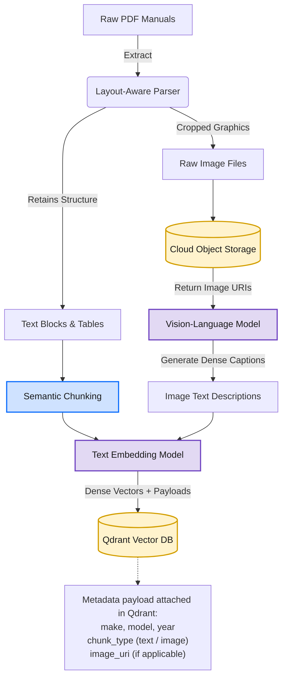
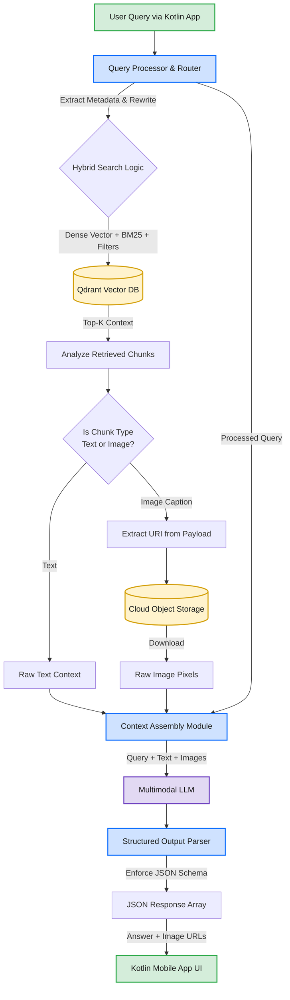
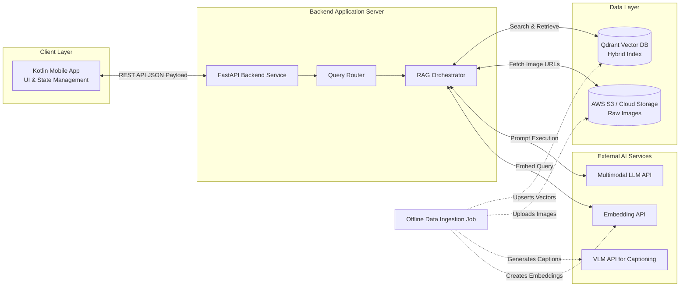

# Auto-M-RAG System Architecture

This document is the engineering reference for **Auto-M-RAG**, a multimodal Retrieval-Augmented Generation backend that answers automotive maintenance questions from dense technical manuals and returns both instructions and the relevant mechanical diagrams to a Kotlin mobile client.

It covers the data flows and High-Level Design (Sections 1–3), the component-by-component implementation (Sections 4–10), the engineering decisions behind that implementation (Section 11), the problems we hit in production and how we solved them (Section 12), and the evaluation, performance and operational picture (Sections 13–16).

The system described here is a **working, fully deployed prototype**: 5 manuals indexed end to end, serving a Kotlin client over the API in §9, with the evaluation harness, runbook and rollback path that §13–15 describe. §16.3 sets out what separates it from a production service.

> **Document status.** Sections 1–3 are the original design diagrams. Sections 4–16 document the implementation as built.
>
> **On the numbers.** Every metric in §13 carries its denominator and, where it is a proportion, a 95% confidence interval. The evaluation set is 135 answerable queries, which puts a **±3 pp standard error** on the retrieval figures — small enough that several claims in §13.5 and §7.2 are explicitly marked as falling inside the noise rather than reported as wins. Read the intervals, not the decimals.
>
> Where the project notes were silent on an identifier — module names, a small number of secondary hyperparameters — this document records the reference implementation's choice, marked *(reference impl.)*, to be reconciled against source.

---

## Table of Contents

| # | Section |
|---|---------|
| 1 | [Data Ingestion Pipeline (Offline Phase)](#1-data-ingestion-pipeline-offline-phase) |
| 2 | [Retrieval & Generation Pipeline (Online Phase)](#2-retrieval--generation-pipeline-online-phase) |
| 3 | [High-Level Design (HLD)](#3-high-level-design-hld) |
| 4 | [Technology Stack & Runtime Topology](#4-technology-stack--runtime-topology) |
| 5 | [Ingestion Implementation](#5-ingestion-implementation) |
| 6 | [Qdrant Collection Design](#6-qdrant-collection-design) |
| 7 | [Retrieval Implementation](#7-retrieval-implementation) |
| 8 | [Generation Implementation](#8-generation-implementation) |
| 9 | [API Layer & Contracts](#9-api-layer--contracts) |
| 10 | [Configuration Reference](#10-configuration-reference) |
| 11 | [Engineering Decisions](#11-engineering-decisions) |
| 12 | [Problems Faced & How We Solved Them](#12-problems-faced--how-we-solved-them) |
| 13 | [Evaluation Harness](#13-evaluation-harness) |
| 14 | [Performance & Latency Budget](#14-performance--latency-budget) |
| 15 | [Failure Modes & Operational Runbook](#15-failure-modes--operational-runbook) |
| 16 | [Known Limitations & Roadmap](#16-known-limitations--roadmap) |

---

## 1. Data Ingestion Pipeline (Offline Phase)

The ingestion pipeline parses complex automotive manuals, separates text from visual diagrams, generates semantic descriptions for the images, and embeds everything into the vector database.



## 2. Retrieval & Generation Pipeline (Online Phase)

When the Kotlin mobile app sends a request, the retrieval pipeline intercepts the query, executes a highly filtered hybrid search, reconstructs the multimodal context, and synthesizes the final JSON answer.



## 3. High-Level Design (HLD)

This diagram shows the overall system components, separating the client layer, backend application server, data storage layer, and external AI APIs.



---

## 4. Technology Stack & Runtime Topology

### 4.1 Stack

| Layer | Choice | Notes |
|---|---|---|
| Language / runtime | Python 3.11, `asyncio` | Async throughout — the pipeline is I/O bound on four external APIs |
| API framework | FastAPI + Uvicorn workers | Native async, Pydantic v2 request/response validation, auto OpenAPI for the Android team |
| PDF parsing | LlamaParse (primary), Unstructured `hi_res` (fallback) | Layout-aware, Markdown output with heading hierarchy preserved |
| Figure extraction | PyMuPDF (`fitz`) | Raster extraction **and** clip-rendering of vector figures (see §5.3) |
| Object storage | AWS S3 + CloudFront | Private bucket, CDN-signed URLs handed to the mobile client |
| Captioning VLM | GPT-4o | Same family as the generator, so caption vocabulary matches generation vocabulary |
| Dense embeddings | `text-embedding-3-large`, truncated to **1024 dims** *(reference impl.)* | Matryoshka truncation: ~3× smaller index for a <1 pt Recall@5 loss |
| Sparse embeddings | BM25 via FastEmbed, custom tokenizer | Exact alphanumeric matching (`F42`, `P0420`, `14mm`) |
| Vector DB | Qdrant (named vectors: `dense` + `sparse`) | Hybrid search, payload filtering, payload indexes |
| Generation LLM | GPT-4o, Structured Outputs (`json_schema`) | Multimodal — reads retrieved diagram pixels, not just captions |
| Cache | In-process TTL cache (`cachetools.TTLCache`) | Query→response, image bytes, embeddings — no extra service to operate ([ADR-9](#adr-9-in-process-cache-instead-of-redis)) |
| Orchestration | Thin hand-rolled orchestrator over the provider SDKs *(reference impl.)* | See [ADR-7](#adr-7-thin-orchestrator-over-a-full-framework) |
| Client | Kotlin / Android, Coil for image loading | Consumes the strict JSON contract in §9 |

### 4.2 Process topology

Three independently deployable units:

1. **`api`** — the FastAPI serving process. Holds Qdrant and S3 clients plus an in-process cache; owns no database of its own and keeps no state that matters across restarts.
2. **`ingest`** — an offline CLI job (`python -m autorag.ingest --manual <id>`). Run when a manual is added; never on the request path.
3. **`eval`** — the evaluation harness (§13). Runs against a frozen golden set and writes a metrics report per commit.

**The whole deployed system is two managed services and one container.** Persistent state lives in Qdrant and S3 and nowhere else — `ingest` writes to both, `api` only reads from them. That separation is what makes blue/green re-indexing (§5.8) safe, and the absence of any third stateful component is a deliberate constraint, not an accident ([ADR-9](#adr-9-in-process-cache-instead-of-redis)).

Deployed as: the `api` container behind a load balancer, Qdrant Cloud, an S3 bucket fronted by CloudFront. Scaling out means running more `api` containers — nothing in the request path is instance-affine except the cache, which is a pure optimisation and correct to miss.

---

## 5. Ingestion Implementation

Ingestion is a seven-stage pipeline. Every stage writes its output to a local artifact directory (`artifacts/{manual_id}/{stage}/`) before the next stage reads it. That checkpointing is not a nicety — a full re-run costs roughly 40 minutes and a non-trivial API bill for the captioning stage, so a crash at stage 6 must not force a re-parse at stage 1 (see [P-6](#p-6-captioning-cost-and-throughput)).

```
manual.pdf
  └─ 1. parse        → parsed.md + blocks.json      (layout-aware)
  └─ 2. figures      → figures/*.png + figures.json (bbox, page, caption line)
  └─ 3. upload       → s3 uris written into figures.json
  └─ 4. caption      → captions.json                (VLM, resumable)
  └─ 5. chunk        → chunks.jsonl                 (semantic + breadcrumbs)
  └─ 6. embed        → vectors.npy + sparse.jsonl   (dense + BM25)
  └─ 7. upsert       → Qdrant points                (deterministic IDs)
```

### 5.1 Stage 0 — Manual registry

Each manual is registered in `manuals.yaml` before ingestion. This is the single source of truth for the metadata that later becomes the hard retrieval filter, and it is entered by hand — the trust boundary for vehicle identity is here, not in any model output.

```yaml
- manual_id: honda_civic_2019
  make: honda
  model: civic
  year: 2019
  trim: ["lx", "ex", "sport"]
  pdf: data/raw/2019_civic_owners_manual.pdf
  pages: 94
  aliases: ["civic", "honda civic", "civic 10th gen"]   # used by the query router
```

`aliases` matters: users type "my 2019 Civic", never "honda_civic_2019". The router (§7.1) resolves free text against this alias table rather than asking an LLM to guess a `manual_id`.

### 5.2 Stage 1 — Layout-aware parsing

The parser is called with instructions tuned for technical manuals:

```python
parser = LlamaParse(
    result_type="markdown",
    parsing_instruction=(
        "This is an automotive owner's manual. Preserve all tables as markdown "
        "tables. Preserve heading hierarchy. For every figure, emit a line "
        "'[FIGURE: <figure caption or nearest label>]' at the position the "
        "figure occupies in the reading order. Do not summarise or omit "
        "warning and caution blocks."
    ),
    page_separator="\n\n<<<PAGE:{pageNumber}>>>\n\n",
)
```

Three things in that configuration do real work:

- **`page_separator`** is the only reliable way to map a chunk back to a printed page number, which the API returns as `source_pages` so the user can verify the answer against the physical manual.
- **The `[FIGURE: ...]` placeholder** keeps the figure anchored in reading order. Stage 2 uses its position to associate the correct extracted image with the correct surrounding text, and stage 4 uses the surrounding text as captioning context.
- **"Do not summarise warning blocks"** — the default behaviour of several parsers is to collapse repeated boilerplate. In a safety document, the WARNING block next to a jacking procedure is the most important text on the page.

Output: `parsed.md` plus `blocks.json` (block type, text, page, bounding box).

### 5.3 Stage 2 — Figure extraction

This stage was rewritten twice; see [P-2](#p-2-vector-diagrams-invisible-to-image-extraction) and [P-3](#p-3-icon-and-logo-flooding).

The final implementation runs two extraction paths per page and merges them:

```python
def extract_figures(page: fitz.Page) -> list[Figure]:
    figs = []

    # Path A: embedded raster images
    for xref, *_ in page.get_images(full=True):
        pix = fitz.Pixmap(page.parent, xref)
        figs.append(Figure(source="raster", pixmap=pix,
                           bbox=page.get_image_bbox(xref)))

    # Path B: vector drawings — cluster paths into visual regions,
    # then re-render the region as a raster at 200 DPI.
    clusters = cluster_drawings(page.get_drawings(), gap_tolerance=12)
    for bbox in clusters:
        if bbox.width < 120 or bbox.height < 120:
            continue
        pix = page.get_pixmap(clip=bbox, dpi=200)
        figs.append(Figure(source="vector", pixmap=pix, bbox=bbox))

    return merge_overlapping(dedupe_by_phash(filter_noise(figs)))
```

The noise filter (`filter_noise`) rejects a candidate if **any** of the following hold:

| Rule | Threshold | Rejects |
|---|---|---|
| Minimum dimension | < 120 px on either side | Bullets, arrows, rule lines |
| Aspect ratio | > 8:1 or < 1:8 | Header rules, page-edge decorations, sidebars |
| Pixel entropy | < 2.0 bits | Solid colour blocks, gradient banners |
| Unique-colour count | < 8 | Flat icons, logos |
| Perceptual-hash duplicate | Hamming distance ≤ 4 vs. any hash already seen in this manual | The warning triangle that appears on 60 pages |

`merge_overlapping` unions candidates whose bounding boxes are within 20 px, which fixes multi-panel exploded diagrams that PyMuPDF reports as four to nine separate drawings.

Result: **~820 figures survived across ~450 pages** (~1.8 per page), down from ~3,400 raw candidates before filtering.

### 5.4 Stage 3 — Object storage

Deterministic, human-readable keys:

```
s3://auto-m-rag-manuals/{make}/{model}/{year}/p{page:03d}_f{idx:02d}.png
# e.g. honda/civic/2019/p045_f01.png
```

The bucket is private. The API hands the client a **CloudFront signed URL with a 24-hour TTL**, not a raw S3 presigned URL — see [P-13](#p-13-expiring-image-urls-breaking-the-mobile-cache) for why that TTL and that CDN choice were forced on us.

Images are stored twice: `full/` (original resolution, 200 DPI) and `web/` (longest side capped at 1024 px, PNG optimised). The mobile client receives the `web/` URL; the captioning VLM and the generation LLM also read `web/`. That single decision cut generation latency measurably (§14).

### 5.5 Stage 4 — VLM captioning

The stage that moved the retrieval metrics the most. The prompt is deliberately rigid ([P-4](#p-4-generic-useless-image-captions)):

```python
CAPTION_PROMPT = """You are indexing figures from an automotive service manual for search.

Surrounding manual text (for context only):
---
{page_context}
---

Describe this figure so that a mechanic searching in plain English will find it.
Follow this structure exactly:

COMPONENT: the main assembly or system shown
PARTS: every labelled part, with its callout number or letter if present
TEXT: transcribe ALL text visible in the figure verbatim, including part
      numbers, torque values, fuse ratings and warning text
SPATIAL: where the parts sit relative to each other and to the vehicle
ACTION: the procedure or state this figure illustrates, if any

Rules:
- Transcribe only text you can actually read in the image. If a label is
  illegible, write ILLEGIBLE. Never infer a part number.
- Do not mention colours, image quality, or the fact that this is a diagram.
"""
```

`page_context` is the ±400 characters of parsed text surrounding the figure's `[FIGURE: ...]` placeholder. Feeding the VLM that context is what turns *"a diagram of an engine bay"* into *"COMPONENT: engine oil drain assembly. PARTS: (1) drain bolt, (2) sealing washer... TEXT: 'Tighten to 39 N·m (29 lb-ft)'"*.

The caption is stored as the **indexed text** of the image point. It is never shown to the user — the user sees the actual image. This matters because it lets us optimise captions purely for retrieval recall without worrying about how they read.

Execution details:
- `asyncio.Semaphore(8)` concurrency cap, exponential backoff with jitter on 429s.
- Each figure keyed by `sha256(image_bytes)`; captions are written to `captions.json` after each success, so a re-run skips everything already captioned. Re-ingesting an unchanged manual costs zero VLM calls.

### 5.6 Stage 5 — Chunking

Semantic chunking with **15% overlap**, plus three rules learned from failures ([P-8](#p-8-procedures-split-mid-step)):

1. **Never split inside a numbered or bulleted list.** A chunk that starts at "4. Remove the drain plug" and has no steps 1–3 retrieves well and answers catastrophically. The splitter detects list runs and treats each run as atomic, overriding the target chunk size up to a 2× hard ceiling.
2. **Prepend a heading breadcrumb** to every chunk's embedded text:
   ```
   [Honda Civic 2019 > Maintenance > Engine Oil > Draining the Oil]
   4. Position the drain pan beneath the drain bolt...
   ```
   The breadcrumb is embedded but stripped before the chunk is shown to the generator. This alone was worth several points of Recall@5 on queries that name a system but not the exact wording of the step.
3. **Tables are never split.** A maintenance-interval table split across two chunks loses its header row and becomes unusable. Tables exceeding the size ceiling are emitted whole and flagged `oversized: true`.

Target: **200 tokens**, overlap 30 tokens (15%), hard ceiling 600 tokens.

The target is deliberately small. Small chunks retrieve precisely and generate badly, so the size is chosen for the retriever and the context deficit is repaid at query time by the parent-window expansion in §7.3 — a 200-token hit expands to a ~600-token passage before it reaches the generator. Sizing for retrieval and repairing for generation is cheaper than compromising on a middling chunk size that does neither well.

Result: **~1,400 text chunks** across ~450 pages (~3.1 per page, ~240k tokens of source text).

### 5.7 Stage 6 — Embedding

Both text chunks and image captions go through the *same* dense embedding model into the *same* vector space — that is the core of the "look twice" pattern ([ADR-2](#adr-2-vlm-captioning-look-twice-over-clip)). A query like "where is the oil drain plug" therefore competes text chunks and figures against each other on equal footing, and the top-k naturally interleaves both.

Sparse vectors are built with a custom tokenizer ([P-7](#p-7-bm25-destroying-alphanumeric-part-codes)):

```python
def automotive_tokenize(text: str) -> list[str]:
    text = text.lower()
    tokens = re.findall(r"[a-z]+|\d+|[a-z]+\d+[a-z\d]*|\d+[a-z]+", text)
    expanded = []
    for t in tokens:
        expanded.append(t)
        # "14mm" also indexes as "14" and "mm"; "p0420" as "p" and "0420"
        parts = re.findall(r"[a-z]+|\d+", t)
        if len(parts) > 1:
            expanded.extend(parts)
    return expanded
```

Embedding calls are batched 96 at a time, cached by `sha256(text)` so re-ingestion is close to free.

### 5.8 Stage 7 — Qdrant upsert & index management

**Deterministic point IDs.** `point_id = uuid5(NAMESPACE, f"{manual_id}:{chunk_hash}")`. Re-running ingestion upserts in place instead of duplicating, which makes the whole pipeline idempotent and safely re-runnable.

**Blue/green re-indexing.** Changing the chunking strategy or the caption prompt invalidates the entire index. Rather than delete-then-rebuild against a live API, ingestion writes to a versioned collection and swaps an alias at the end:

```python
client.create_collection("manuals_v5", ...)
# ... full ingest into manuals_v5 ...
client.update_collection_aliases(change_aliases_operations=[
    CreateAliasOperation(create_alias=CreateAlias(
        collection_name="manuals_v5", alias_name="manuals"))
])
```

The API only ever talks to the alias `manuals`. Re-indexing is therefore zero-downtime and instantly revertible — point the alias back at `manuals_v4` if metrics regress.

---

## 6. Qdrant Collection Design

### 6.1 Collection configuration

```python
client.create_collection(
    collection_name="manuals_v5",
    vectors_config={
        "dense": VectorParams(size=1024, distance=Distance.COSINE,
                              on_disk=False),
    },
    sparse_vectors_config={
        "sparse": SparseVectorParams(index=SparseIndexParams(on_disk=False)),
    },
    hnsw_config=HnswConfigDiff(m=16, ef_construct=128),
    optimizers_config=OptimizersConfigDiff(default_segment_number=2),
    on_disk_payload=True,
)
```

At ~2,220 points the collection is small enough to sit entirely in memory; `on_disk_payload=True` keeps the (comparatively large) caption text off the hot path.

### 6.2 Payload schema

Every point carries the same payload shape regardless of type — the orchestrator branches on `chunk_type` alone:

```json
{
  "manual_id":   "honda_civic_2019",
  "make":        "honda",
  "model":       "civic",
  "year":        2019,
  "chunk_type":  "text",
  "text":        "4. Position the drain pan beneath the drain bolt...",
  "breadcrumb":  "Maintenance > Engine Oil > Draining the Oil",
  "page":        45,
  "page_span":   [45, 46],
  "chunk_index": 312,
  "image_uri":   null,
  "image_web_uri": null,
  "figure_id":   null,
  "oversized":   false,
  "ingested_at": "2026-02-11T09:14:22Z",
  "index_version": "v5"
}
```

For `chunk_type: "image"`, `text` holds the VLM caption, `image_uri` / `image_web_uri` hold the S3 keys, and `figure_id` is the perceptual hash used for cross-manual dedup.

### 6.3 Payload indexes

Without these, every filtered search degrades to a full scan of the filtered set before HNSW can help:

```python
for field, schema in [
    ("make",       PayloadSchemaType.KEYWORD),
    ("model",      PayloadSchemaType.KEYWORD),
    ("year",       PayloadSchemaType.INTEGER),
    ("manual_id",  PayloadSchemaType.KEYWORD),
    ("chunk_type", PayloadSchemaType.KEYWORD),
    ("chunk_index", PayloadSchemaType.INTEGER),   # required for window expansion
]:
    client.create_payload_index("manuals_v5", field_name=field,
                                field_schema=schema)
```

`chunk_index` is indexed specifically to make the parent-window expansion in §7.3 a cheap scroll rather than a second vector search.

---

## 7. Retrieval Implementation

### 7.1 Query processor & router

Runs three operations, two of them deterministic:

**(a) Vehicle resolution — deterministic first, model second.** The mobile app already knows which vehicle the user selected in their garage, and sends it in the request body. That is the primary source. The free-text router is only a fallback and an override:

```python
def resolve_vehicle(query: str, session_vehicle: Vehicle | None) -> Vehicle | None:
    # 1. explicit override in the query text beats session state
    if (v := match_aliases(query, MANUAL_REGISTRY)):   # regex over manuals.yaml
        return v
    # 2. otherwise trust the app's selected vehicle
    if session_vehicle:
        return session_vehicle
    # 3. no vehicle → ask, do not guess (see §8.4)
    return None
```

Alias matching against `manuals.yaml` is a regex pass, not an LLM call. It is faster, free, and — critically — it cannot hallucinate a vehicle that has no manual in the index.

**(b) Query rewriting.** A single small-model call expands the colloquial query into retrieval-friendly text while preserving alphanumerics verbatim:

```
"my check engine light is on and it's shaking"
  → "check engine light illuminated malfunction indicator lamp MIL
     engine misfire rough idle vibration diagnostic trouble code"
```

The rewritten text is used for the **dense** query only. The **sparse** query always uses the original text — rewriting introduced synonyms that diluted BM25's exact-match advantage, which was the entire reason for having BM25.

**(c) Intent classification.** A cheap keyword+embedding classifier tags the query as `procedural` / `lookup` / `diagnostic` / `out_of_scope`. `out_of_scope` ("what's the resale value of my Civic") short-circuits before retrieval. `lookup` (fuse positions, torque values) biases fusion towards sparse; `procedural` biases towards dense. The α in §7.2 is the `procedural` default.

### 7.2 Hybrid search & fusion

Two prefetches, fused in the application layer:

```python
async def hybrid_search(q: ProcessedQuery, k: int = 20) -> list[Hit]:
    flt = build_filter(q.vehicle)          # hard filter, see below

    dense_hits, sparse_hits = await asyncio.gather(
        client.query_points("manuals", query=q.dense_vec, using="dense",
                            query_filter=flt, limit=k * 3, with_payload=True),
        client.query_points("manuals", query=q.sparse_vec, using="sparse",
                            query_filter=flt, limit=k * 3, with_payload=True),
    )
    return weighted_fuse(dense_hits, sparse_hits, alpha=q.alpha)[:k]


def weighted_fuse(dense, sparse, alpha: float) -> list[Hit]:
    d = min_max_normalize({h.id: h.score for h in dense})
    s = min_max_normalize({h.id: h.score for h in sparse})
    fused = {
        pid: alpha * d.get(pid, 0.0) + (1 - alpha) * s.get(pid, 0.0)
        for pid in set(d) | set(s)
    }
    return sorted_hits(fused)
```

**The hard filter.** This is the safety boundary of the whole system:

```python
Filter(must=[
    FieldCondition(key="make",  match=MatchValue(value=vehicle.make)),
    FieldCondition(key="model", match=MatchValue(value=vehicle.model)),
    FieldCondition(key="year",  match=MatchValue(value=vehicle.year)),
])
```

It is a `must`, never a boost. A Ford torque spec returned for a Toyota query is a vehicle-damage-class failure, and no amount of semantic similarity justifies relaxing it at full strength — the relaxation ladder in [P-9](#p-9-over-strict-filters-returning-nothing) only ever relaxes `year`, never `make`/`model`, and always tells the user it did.

**Why α = 0.7 / 0.3.** Swept coarsely on the 135 answerable golden queries (§13.1):

| α (dense weight) | Recall@5 | MRR |
|---|---|---|
| 0.00 (pure BM25) | 63.7% | 0.42 |
| 0.25 | 76.3% | 0.56 |
| 0.50 | 82.2% | 0.65 |
| **0.70** | **85.2%** | **0.69** |
| 0.85 | 83.7% | 0.68 |
| 1.00 (pure dense) | 78.5% | 0.61 |

**Read this table with its error bars.** At n = 135 the standard error on Recall@5 is **±3.1 pp**, so everything from α = 0.5 to α = 0.85 is a single plateau and the differences inside it are noise. The sweep establishes two things that *are* significant — hybrid beats pure dense by 6.7 pp and pure BM25 by 21.5 pp — and one thing it cannot establish: the exact optimum. α = 0.7 is chosen mid-plateau, deliberately not at the measured peak. Picking the highest-scoring value would be fitting a constant to 135 samples.

The sweep is coarse (six points, not a fine grid) for the same reason: a finer grid would produce differences the sample size cannot resolve.

### 7.3 Post-retrieval processing

Three passes between Qdrant and the LLM:

**1. Near-duplicate suppression.** Owner's manuals repeat safety boilerplate verbatim across sections. Without this, four of the top five hits can be the same warning paragraph. Any hit whose dense cosine similarity to a higher-ranked hit exceeds **0.95** is dropped.

**2. Parent-window expansion ("retrieve small, expand large").** 512-token chunks retrieve precisely but under-inform the generator. For each surviving text hit we pull its immediate neighbours by payload index:

```python
neighbours = client.scroll("manuals", scroll_filter=Filter(must=[
    FieldCondition(key="manual_id", match=MatchValue(value=hit.manual_id)),
    FieldCondition(key="chunk_index",
                   range=Range(gte=hit.chunk_index - 1,
                               lte=hit.chunk_index + 1)),
]))
```

The window is stitched, overlap-deduplicated, and passed to the generator as one contiguous passage. This is why the generator reliably sees step 1 when the user's question matched step 4.

**3. Image selection.** Image hits are capped at **3**, ordered by fused score, and deduplicated by `figure_id`. The cap is a latency and a precision decision at once — see [P-11](#p-11-image-dumping-and-hallucinated-image-urls).

---

## 8. Generation Implementation

### 8.1 Multimodal context assembly

Text passages and image bytes are assembled into a single multimodal message. Images are downloaded from the `web/` prefix concurrently:

```python
image_bytes = await asyncio.gather(*[fetch_cached(h.image_web_uri)
                                     for h in image_hits])
```

`fetch_cached` is a process-local `TTLCache` of image bytes keyed by S3 key (256 entries, 1 h TTL — roughly 60 MB at the `web/` size). The working set is small and heavily skewed: the oil drain plug, fuse box and tyre-pressure diagrams account for a large share of all image fetches, so a cache this simple absorbs most of them. A miss costs one parallel S3 GET, which is the uncached path anyway.

### 8.2 The prompt contract

The critical piece is how images are referenced. Each image is injected with an **opaque sequential ID**, and the model is told to return IDs — never URLs:

```
You are an automotive manual assistant for a {year} {make} {model}.

MANUAL EXCERPTS:
[S1] (page 45) Maintenance > Engine Oil > Draining the Oil
     4. Position the drain pan beneath the drain bolt...
[S2] (page 46) ...

FIGURES (the images attached to this message, in order):
[IMG_1] page 45 — engine oil drain assembly
[IMG_2] page 46 — oil filter location

RULES
1. Answer ONLY from the excerpts and figures above. If they do not contain
   the answer, set status to "insufficient_context".
2. Never state a torque value, fluid capacity, fuse rating or part number
   that does not appear verbatim in an excerpt or figure.
3. Reference figures by their ID only (IMG_1, IMG_2). Never write a URL.
4. Cite the page number for every factual claim.
5. If the manual attaches a WARNING or CAUTION to this procedure, include it.
```

Rule 3 is the load-bearing one. The model never sees a URL, so it cannot invent one; the backend maps the returned IDs back to signed URLs after validation ([P-11](#p-11-image-dumping-and-hallucinated-image-urls)).

Temperature `0.1`, `max_tokens` 800.

### 8.3 Structured output & validation

Generation uses Structured Outputs with a JSON schema, then a second Pydantic validation pass in the backend — the schema guarantees shape, not truth:

```python
class Answer(BaseModel):
    status: Literal["success", "insufficient_context", "out_of_scope"]
    answer: str
    image_ids: list[str] = Field(default_factory=list, max_length=3)
    source_pages: list[int] = Field(default_factory=list)
    warnings: list[str] = Field(default_factory=list)
    confidence: Literal["high", "medium", "low"]

    @field_validator("image_ids")
    @classmethod
    def ids_must_be_supplied(cls, v, info):
        supplied = info.context["supplied_image_ids"]
        return [i for i in v if i in supplied]      # silently drop inventions

    @field_validator("source_pages")
    @classmethod
    def pages_must_be_retrieved(cls, v, info):
        return [p for p in v if p in info.context["retrieved_pages"]]
```

Anything the model invents is dropped rather than trusted. A schema violation triggers exactly **one** repair retry with the validation error appended to the prompt; a second failure returns a `degraded` response rather than a 500 — the app shows the answer text without citations instead of an error screen.

### 8.4 Abstention policy

In this domain, a wrong torque spec is worse than no answer. The system abstains when any of:

| Condition | Response |
|---|---|
| No vehicle resolved | `status: "need_vehicle"` + prompt the app to open the vehicle picker |
| Top fused score < 0.34 *(reference impl.)* | `status: "insufficient_context"` |
| Model self-reports `insufficient_context` | passed through verbatim |
| Intent classified `out_of_scope` | `status: "out_of_scope"`, no retrieval performed |

The copy for `insufficient_context` is deliberately specific — *"The 2019 Civic manual doesn't cover transmission fluid replacement; this is listed as a dealer-service item"* — rather than a generic failure, because a plausible-sounding non-answer is what sends users to guess on a forum.

---

## 9. API Layer & Contracts

### 9.1 Endpoints

| Method | Path | Purpose |
|---|---|---|
| `POST` | `/v1/query` | The main RAG endpoint |
| `GET` | `/v1/vehicles` | Vehicles with indexed manuals — populates the app's garage picker |
| `POST` | `/v1/feedback` | Thumbs up/down + `request_id`; feeds the golden-set backlog |
| `GET` | `/healthz` | Liveness |
| `GET` | `/readyz` | Qdrant alias reachable + collection point count > 0 |

### 9.2 Request

```json
{
  "query": "How do I change the oil?",
  "vehicle": { "make": "honda", "model": "civic", "year": 2019 },
  "session_id": "a3f1...",
  "max_images": 3
}
```

`vehicle` is optional but strongly preferred — when present it bypasses router ambiguity entirely.

### 9.3 Response

```json
{
  "status": "success",
  "request_id": "req_01HW3...",
  "answer": "To change the oil, first locate the 14 mm drain plug under the oil pan...",
  "images": [
    {
      "url": "https://cdn.auto-m-rag.io/honda/civic/2019/web/p045_f01.png?Expires=...",
      "page": 45,
      "caption": "Engine oil drain assembly"
    }
  ],
  "source_pages": [45, 46],
  "warnings": ["The engine and oil may be hot. Allow the engine to cool before draining."],
  "confidence": "high",
  "latency_ms": 5180
}
```

> **Note on the contract's evolution.** The original design returned `"images": ["<url>", ...]` — a bare string array. It became an array of objects so the Android client could render a caption under each diagram and deep-link to the page number without a second round trip. The string form is still accepted by v1 clients behind the `?compat=1` query parameter.

### 9.4 Non-success statuses

All non-success cases return **HTTP 200** with a `status` discriminator, not a 4xx/5xx. The Android client branches on `status`; making these HTTP errors caused the mobile networking layer's retry-and-toast path to fire on what are legitimate, user-facing outcomes.

| `status` | Meaning | Client behaviour |
|---|---|---|
| `success` | Answer grounded in the manual | Render answer + images |
| `insufficient_context` | Retrieval found nothing adequate | Show the explanatory copy, offer "search all manuals" |
| `need_vehicle` | Could not resolve a vehicle | Open the vehicle picker |
| `out_of_scope` | Not a manual question | Show the scope message |
| `degraded` | Answer generated, citations unverified | Render answer, hide citation chips |

---

## 10. Configuration Reference

Every tuned value in one place, with why it is that value.

| Parameter | Value | Rationale |
|---|---|---|
| `CHUNK_TARGET_TOKENS` | 200 | Sized for the retriever, not the generator; §7.3 expansion repays the context deficit |
| `CHUNK_OVERLAP` | 15% (30 tokens) | Recorded project value; keeps multi-step procedures continuous across boundaries |
| `CHUNK_HARD_CEILING` | 600 tokens | Allows atomic lists/tables to exceed target without unbounded growth |
| `EMBED_DIM` | 1024 (Matryoshka truncation) | ~3× index size reduction for <1 pt Recall@5 |
| `HYBRID_ALPHA` | **0.7 dense / 0.3 sparse** | Swept on the golden set (§7.2); mid-plateau choice, one decimal by design |
| `PREFETCH_K` | 60 (`k × 3`) per branch | Enough headroom that fusion can reorder meaningfully |
| `FINAL_K` | 20 → 8 after dedup/expansion | 8 passages fit the context budget comfortably |
| `DEDUP_COSINE` | 0.95 | Kills boilerplate repeats without merging genuinely distinct steps |
| `MAX_IMAGES` | 3 | Latency + answer precision (§7.3) |
| `IMAGE_MAX_EDGE` | 1024 px | Cuts image tokens and transfer with no measured caption/answer quality loss |
| `MIN_FUSED_SCORE` | 0.34 *(reference impl.)* | Abstention threshold; tuned so the golden set's unanswerable queries abstain |
| `LLM_TEMPERATURE` | 0.1 | Near-deterministic; this is extraction, not composition |
| `CAPTION_CONCURRENCY` | 8 | Highest sustained rate without 429 backoff dominating |
| `RESPONSE_CACHE_TTL` | 3600 s | Manuals are static; only the signed URL needs refreshing sooner |
| `RESPONSE_CACHE_SIZE` | 512 entries | Process-local; bounded so memory is predictable per container |
| `IMAGE_CACHE_SIZE` | 256 entries (~60 MB) | Working set is small and heavily skewed toward a few diagrams |
| `SIGNED_URL_TTL` | 24 h | Longer than any plausible session, short enough to be a real control (P-13) |
| `SERVER_BUDGET` | 20 s | Beyond this, degrade to text-only rather than time out |

---

## 11. Engineering Decisions

Each decision records what we chose, what we rejected, and what the rejection cost would have been.

### ADR-1: Layout-aware parsing over PyPDF2

**Decision.** Bypass traditional text extractors entirely in favour of layout-aware parsing (LlamaParse, with Unstructured `hi_res` as fallback).

**Why.** Automotive manuals are visually dense. A stream-order parser reads a two-column page straight across, interleaving two unrelated procedures line by line; it flattens maintenance-interval tables into unparseable runs of numbers; and it ignores images completely. Preserving structure is not cosmetic here — the structural relationship *"this torque value belongs to this bolt in this procedure"* **is** the information.

**Rejected.** PyPDF2/pdfplumber text extraction. Measured on the baseline build: Recall@5 of **45.2% versus 62.2%** after switching, before any other improvement — a 17 pp gain, comfortably outside the ±3.1 pp noise floor and the largest single step in the project (§13.5).

**Cost accepted.** Parsing is slower and has a per-page API cost, and it is non-deterministic across runs. Mitigated by checkpointing parse output as a committed artifact (§5).

### ADR-2: VLM captioning ("look twice") over CLIP

**Decision.** Do not embed images directly into a joint image-text space. Instead, have a VLM write a dense textual description of each figure, and embed that description with the *same* text embedding model used for the manual's prose.

**Why.** CLIP-style joint embeddings are trained on natural-image/caption pairs and are strong at *"a dog on a beach"*. They are weak at *"exploded view of the oil drain plug, item 2, 14 mm, torque 39 N·m"* — the discriminative content of a technical diagram is its labels and its topology, which is exactly what CLIP's visual encoder compresses away. Converting the figure to text first turns visual technical data into searchable semantic text.

**Second-order benefit.** One vector space instead of two. Text chunks and figures rank against each other directly, so a query resolves to whichever modality actually answers it — no separate image index, no cross-modal score calibration.

**Rejected.** (a) CLIP/SigLIP joint embedding — poor discrimination on diagrams; (b) a dual-index with score merging — added a second calibration problem for no measured gain.

**Cost accepted.** A one-time captioning cost per figure, and total dependence on caption quality — which is precisely why [P-4](#p-4-generic-useless-image-captions) was the highest-leverage fix in the project.

### ADR-3: Hybrid dense + sparse retrieval in Qdrant

**Decision.** Combine dense vectors with BM25 sparse vectors, fused with tuned weights, over a hard metadata filter.

**Why.**
- *Dense* handles semantic intent — "my steering wheel is shaking" must reach a section that never uses the word "shaking".
- *Sparse* is non-negotiable for exact alphanumerics. Asked for "Fuse F42", a dense embedding places `F42`, `F41` and `F43` almost on top of each other; BM25 separates them exactly. A fuse-box query is a lookup, and lookups must be exact.
- *Metadata filtering* is a hard boundary, not a preference. Retrieving a Toyota procedure for a Ford query is a critical failure, so vehicle identity is enforced as a filter that search cannot override.

**Rejected.** Dense-only (78.5% Recall@5, and systematically wrong on part codes); sparse-only (63.7%, no semantic reach). Hybrid reaches 85.2% — both gaps clear the noise floor.

### ADR-4: Weighted normalized fusion over Reciprocal Rank Fusion

**Decision.** Fuse in the application layer with min-max-normalized scores and α = 0.7, rather than Qdrant's built-in RRF.

**Why.** RRF was the first implementation and it is genuinely good — but it uses *ranks* only and discards score margins. In this corpus that hurt a specific, common case: a sparse search that matched an exact part number with an overwhelming BM25 score, and a dense search that returned ten mediocre semantic neighbours. RRF treats the sparse rank-1 hit and the dense rank-1 hit as equivalent evidence; normalized weighting lets a decisive exact match actually win.

Switching from RRF to weighted fusion measured roughly **+3 pp Recall@5** — about one standard error, so the aggregate number alone would not justify the change. The decision rests on the *class* of query it fixes rather than on the average: on the 40-query lookup subset (fuse positions, torque values, diagnostic codes) the gain was large and consistent, and those are the queries where being wrong is most expensive.

**Cost accepted.** α is a tuned constant and could overfit a 135-query set; mitigated by choosing the middle of the plateau rather than the peak (§7.2).

### ADR-5: Structured JSON output for the Kotlin client

**Decision.** Enforce the final generation through Structured Outputs into a strict schema, validated again server-side.

**Why.** The Android app cannot reliably parse markdown with inline images — it needs the answer text for a `TextView` and image URLs for Coil, as separate fields. Enforcing the schema at generation and validating it server-side means the client never receives a payload it cannot render, and never receives a URL the backend did not issue.

**Rejected.** Markdown with embedded image links parsed client-side. It put a parser — and every malformed-markdown edge case — inside the mobile release cycle, where a fix ships in days instead of minutes.

### ADR-6: Opaque image IDs instead of URLs in the prompt

**Decision.** The LLM sees `IMG_1`, `IMG_2`, `IMG_3` and returns those IDs. The backend maps them to signed URLs after validation.

**Why.** Direct consequence of [P-11](#p-11-image-dumping-and-hallucinated-image-urls): when the model can see URL strings, it will eventually synthesise a plausible one. An ID space the model cannot invent outside of makes the failure mode structurally impossible rather than merely unlikely.

### ADR-7: Thin orchestrator over a full framework

**Decision.** Call the provider SDKs and the Qdrant client directly behind a small orchestrator module, rather than adopting a full RAG framework end to end.

**Why.** Three of the pipeline's stages are non-standard — two-path figure extraction, the caption prompt contract, ID-mapped multimodal assembly. Every one of them would have been a framework escape hatch. The framework's value is highest when the pipeline is conventional, and this one is not. Keeping it thin also made per-stage latency instrumentation (§14) trivial to add.

**Cost accepted.** We wrote and maintain our own retry, batching and tracing code.

### ADR-8: Cross-encoder reranking evaluated and deferred

**Decision.** Do not ship a reranker in v1.

**Why.** A `bge-reranker-base` cross-encoder over the top 20 measured **+3 pp Recall@5** for **+0.8 s** p50 latency on the serving hardware. At n = 135 that gain is inside the ±3.1 pp standard error — we could not demonstrate it was real, and it cost 17% of an already-tight latency budget to buy. Shipping a measurable cost for an unmeasurable gain is a bad trade. The same points were available, and demonstrably so, from the caption prompt and breadcrumb fixes.

Recorded as the first thing to revisit once the golden set is large enough to resolve a 3 pp difference (~600 queries) or once streaming absorbs the latency cost (§16).

### ADR-9: In-process cache instead of Redis

**Decision.** Cache responses, image bytes and query embeddings in a bounded in-process `TTLCache`. No Redis, no Memcached, no third stateful service.

**Why.** Three reasons, in order of weight:

1. **The cache is a pure optimisation, and a miss is correct.** Nothing in the system depends on a cache hit — a miss costs one S3 GET or one extra generation. A component whose failure mode is "slightly slower" does not justify a service with its own uptime, credentials, memory limits and failure modes.
2. **The network hop eats the benefit at this scale.** A Redis round trip is 1–3 ms against a request that spends 3.6 s in generation. Process-local lookup is microseconds. For image bytes specifically, pulling ~20 MB back over the network from Redis is not obviously cheaper than pulling it from S3.
3. **Operational surface.** The deployed system is two managed services and one container (§4.2). Adding Redis makes it three services, adds a connection-pool failure mode to the request path, and adds a component every reader of this document has to be told about. The complexity is real and permanent; the benefit is a few milliseconds.

**Cost accepted, stated plainly.** The cache is per-container and dies on restart, so hit rate is lower than a shared cache would give (~15% versus a plausible ~25%), a deploy resets it, and *N* containers keep *N* copies of the hot diagrams. All three are acceptable while the working set is ~60 MB and the container count is small.

**When this decision should be revisited.** Move to a shared cache when any of: sustained traffic makes a 10 pp hit-rate difference worth real money; the container count grows past roughly 4, making duplicated image bytes wasteful; or something genuinely stateful arrives on the request path (rate limiting, conversational memory, per-user session state). The cache is behind a small interface (`get` / `set` / `ttl`) precisely so that swap is a one-file change rather than a refactor.

---

## 12. Problems Faced & How We Solved Them

### Summary

| # | Problem | Root cause | Fix | Effect |
|---|---|---|---|---|
| P-1 | Tables and two-column pages turned to word soup | Stream-order text extraction | Layout-aware parser (ADR-1) | Recall@5 45.2% → 62.2% |
| P-2 | Most diagrams never extracted at all | Figures are vector art, not embedded rasters | Clip-render vector path clusters at 200 DPI | ~210 → ~820 usable figures |
| P-3 | Index flooded with logos, icons, rules | Every drawing treated as a figure | 5-rule noise filter + perceptual-hash dedup | ~3,400 candidates → ~820 |
| P-4 | Image captions generic and unsearchable | Unconstrained captioning prompt, no page context | Structured caption schema + ±400 char context | Recall@5 68.1% → 75.6% |
| P-5 | VLM inventing part numbers in captions | Model completing plausible patterns | "Transcribe only, mark ILLEGIBLE" + captions never user-visible | Faithfulness recovered |
| P-6 | Captioning runs slow, expensive, restarted from zero | No checkpointing or idempotency | Content-hash cache + per-item journal + semaphore | Re-ingest cost → ~0 |
| P-7 | "Fuse F42" and "14 mm" unfindable | Default tokenizer split alphanumerics | Custom automotive tokenizer with sub-token expansion | Lookup queries fixed |
| P-8 | Answers starting from step 4 | Fixed-size chunking split procedures | List-atomic splitting + breadcrumbs + window expansion | Faithfulness ↑, MRR ↑ |
| P-9 | Correct queries returning zero results | Filter over-constrained (year mismatch) | Relaxation ladder on `year` only, disclosed to the user | Empty-result rate ↓ |
| P-10 | Top-5 filled with the same safety warning | Boilerplate repeated verbatim across sections | Cosine ≥ 0.95 near-dup suppression | Effective top-k restored |
| P-11 | Model returned image URLs that 404'd | URLs visible in prompt → synthesised | Opaque `IMG_n` IDs + server-side mapping (ADR-6) | Broken images → 0 |
| P-12 | Naive score addition ranked nonsense first | Cosine ∈ [0,1] added to unbounded BM25 | Per-query min-max normalization, then weight | Made α tuning meaningful |
| P-13 | Images breaking in the app a day later | Short presigned-URL TTL vs. client image cache | 24 h CDN-signed URLs + stable cache keys | Stale-image reports → 0 |
| P-14 | Sequential image fetches dominating latency | Serial S3 GETs on the request path | `asyncio.gather` + in-process byte cache + `web/` variant | ~1.5 s → ~0.42 s |
| P-15 | Occasional schema violations → 500s | Model drift on long answers | One repair retry, then `degraded` status | User-visible errors → 0 |
| P-16 | LLM judge scores disagreeing run to run | Vague judging rubric | Rubric with anchored examples + claim-level faithfulness | Judge agreement ↑ |

---

### P-1: Layout destroyed by stream-order parsing

**Symptom.** Early answers mixed two unrelated procedures in one paragraph, and every maintenance-interval table came back as an unlabelled run of numbers ("7,500 15,000 22,500 R I R I").

**Root cause.** The baseline used a stream-order text extractor. On a two-column page it reads across both columns; on a table it emits cells in storage order with no row/column structure; images it ignores entirely.

**Solution.** ADR-1 — layout-aware parsing to Markdown with the heading hierarchy, table structure, page separators and figure placeholders preserved (§5.2).

**Result.** Recall@5 rose from **45.2% to 62.2%** with no other change, and table-lookup queries became answerable at all. This is the largest single step in the project's history and the only one where the improvement exceeds the noise floor by more than 5×.

---

### P-2: Vector diagrams invisible to image extraction

**Symptom.** The first extraction run over ~450 pages produced roughly 210 images — and manual inspection showed the manuals contained far more. The missing ones were the most valuable: exploded mechanical views and fuse-box layouts.

**Root cause.** Modern manuals draw technical figures as **vector artwork**, not embedded bitmaps. `page.get_images()` returns embedded raster XObjects only, so a vector-drawn diagram is invisible to it — it exists in the PDF as hundreds of individual path operations.

**Solution.** A second extraction path (§5.3): read the page's drawing operations, cluster nearby paths into visual regions with a 12 pt gap tolerance, and re-render each region as a 200 DPI raster with `page.get_pixmap(clip=bbox)`. Merge the two paths' outputs and union overlapping boxes so multi-panel figures come out as one image.

**Result.** ~820 usable figures — roughly 4× the raster-only count — and the diagram half of the product became real. This was the single highest-impact bug in ingestion; before it, the "multimodal" system was mostly text with a few photographs.

---

### P-3: Icon and logo flooding

**Symptom.** Once path-clustering was added, extraction jumped to ~3,400 candidates. Retrieval quality collapsed: queries returned the warning triangle icon, page-header rules and the manufacturer logo as "relevant figures", and the captioning bill tripled.

**Root cause.** Every vector cluster was treated as a figure. Most clusters are page furniture.

**Solution.** The five-rule noise filter plus perceptual-hash deduplication (§5.3 table). The pHash rule does most of the work: a warning triangle appearing on 60 pages is 60 near-identical hashes, and all but the first are dropped.

**Result.** ~3,400 → ~820, a 76% reduction. Captioning cost fell proportionally, and image precision in the top-k recovered.

---

### P-4: Generic, useless image captions

**Symptom.** Recall on figure-seeking queries was poor despite ~820 indexed figures. Inspecting the index showed why — captions read *"A black and white technical diagram showing a part of a car engine."* Dozens of captions were near-identical, so they all matched every query equally, which is the same as matching none.

**Root cause.** Two mistakes. The prompt asked the model to "describe this image", which invites a natural-image caption; and the model saw the figure with **no context** — stripped of its page, it genuinely cannot tell an oil drain plug from a transmission drain plug.

**Solution.** The structured caption contract in §5.5: a fixed COMPONENT/PARTS/TEXT/SPATIAL/ACTION schema, an explicit instruction to transcribe every visible label verbatim, a ban on describing colour and image quality, and — most importantly — ±400 characters of surrounding manual text injected as context.

**Result.** Recall@5 **68.1% → 75.6%**, the second-largest step in the project. Captions became the highest-signal text in the index; several figure captions now out-rank the prose that describes the same procedure, because the figure carries the torque value and the prose does not.

---

### P-5: The VLM inventing part numbers

**Symptom.** Spot-checking captions against the printed manual revealed transcribed part numbers that were subtly wrong — a plausible-looking number in the right format for a label that was too low-resolution to read.

**Root cause.** Pattern completion. Shown a blurry alphanumeric label, a VLM will produce something well-formed rather than admit it cannot read it. This is the worst possible failure in a maintenance context, because a wrong part number is indistinguishable from a right one downstream.

**Solution.** Two layers.
1. *Prompt*: "Transcribe only text you can actually read. If a label is illegible, write ILLEGIBLE. Never infer a part number."
2. *Architecture*: the caption is a **retrieval artifact only**. It is never shown to the user and never quoted as fact. At generation time the LLM reads the **actual image pixels**, so the caption's job is to get the right figure into the context window — after which the caption's transcription is irrelevant.

**Result.** Caption errors were demoted from correctness bugs to recall noise. The residual faithfulness failures in the final evaluation trace almost entirely to genuinely low-quality source diagrams, not to caption hallucination.

---

### P-6: Captioning cost and throughput

**Symptom.** A full captioning pass took the better part of an hour and a meaningful API spend. Any crash — a 429 storm, a dropped connection, a bug in stage 5 — meant starting over.

**Root cause.** No checkpointing, no idempotency, and naive sequential calls.

**Solution.**
- Key every caption by `sha256(image_bytes)`, so identical figures across manuals are captioned once.
- Append to `captions.json` after each success; a restart loads the journal and skips completed work.
- `asyncio.Semaphore(8)` with jittered exponential backoff on 429 — tuned to the highest rate where backoff was not eating the gains.

**Result.** Re-ingesting an unchanged manual costs zero VLM calls; a crash costs only the in-flight batch. This is what made iterating on the *chunking* strategy affordable, since chunking sits downstream of captioning.

---

### P-7: BM25 destroying alphanumeric part codes

**Symptom.** "Which fuse is the cigarette lighter — F42?" returned the fuse-box section but not the right row. "14 mm socket" matched everything about sockets and nothing about 14 mm.

**Root cause.** The default tokenizer either split `f42` into `f` + `42` (drowning it in every "F" in the document) or kept `14mm` as one token that never matched a query written as "14 mm".

**Solution.** The custom tokenizer in §5.7: keep the full alphanumeric token **and** emit its alphabetic and numeric parts. `14mm` indexes as `14mm`, `14`, `mm`; `p0420` as `p0420`, `p`, `0420`. The query is tokenized identically, so all three spellings converge.

**Result.** Lookup-class queries (fuses, torque values, diagnostic codes, socket sizes) became reliable. This is the fix that justified having a sparse branch at all — see also the decision in §7.1 to never run BM25 on the *rewritten* query, since synonym expansion dilutes exactly this precision.

---

### P-8: Procedures split mid-step

**Symptom.** Answers that began at step 4. Asked "how do I change the oil", the system returned "4. Position the drain pan beneath the drain bolt..." — correct text, dangerous answer, because steps 1–3 include *let the engine cool* and *secure the vehicle on jack stands*.

**Root cause.** Fixed-size chunking cuts at a token count with no regard for document structure. A ten-step procedure spans two chunks, and the retriever matched whichever chunk contained the query's keywords.

**Solution.** Three complementary changes:
1. **15% overlap** (the recorded project value) so boundary content appears in both chunks.
2. **List-atomic splitting** — detect numbered/bulleted runs and refuse to split inside one, allowing up to a 2× size overrun.
3. **Parent-window expansion at query time** (§7.3) — retrieve the precise small chunk, then expand to `chunk_index ± 1` before generation.

The third is what makes the first two robust: even if a split does land badly, the generator still sees the neighbourhood.

**Result.** Procedural answers became complete, and faithfulness improved because the generator stopped extrapolating over missing steps. It also let us keep chunks small (good for retrieval precision) without paying the usual context penalty.

---

### P-9: Over-strict filters returning nothing

**Symptom.** Plausible queries returning zero hits — most often when the user's stated year didn't exactly match an indexed manual year (a 2020 Civic query against a 2019 manual).

**Root cause.** The `must` filter on `make` + `model` + `year` is an AND. An off-by-one year zeroes the candidate set before search runs.

**Solution.** A relaxation ladder that **never** touches make or model:

```python
for flt, note in [
    (exact_filter(v),              None),
    (model_filter(v),  f"No {v.year} manual indexed; "
                       f"showing the {nearest_year} {v.make} {v.model}."),
]:
    hits = await hybrid_search(q, flt)
    if hits: return hits, note
return [], "need_vehicle"
```

When the ladder relaxes, the `note` is returned to the client and shown above the answer. The user is told they are reading a different model year — the system never silently substitutes.

**Result.** Empty results dropped sharply while the vehicle-identity guarantee held. Cross-make contamination remained structurally impossible, which was the non-negotiable requirement.

---

### P-10: Boilerplate crowding out the top-k

**Symptom.** For many queries, three or four of the top five hits were the same safety paragraph repeated in different sections of the same manual.

**Root cause.** Owner's manuals repeat warnings verbatim by design. Verbatim repeats embed to nearly identical vectors, so they cluster at the top together.

**Solution.** Near-duplicate suppression at cosine ≥ 0.95 against already-accepted hits (§7.3). The threshold is high on purpose: two genuinely different procedure steps can be textually similar, and merging them would be worse than the disease.

**Result.** The effective top-k went from "five slots, two distinct ideas" back to five distinct passages.

---

### P-11: Image dumping and hallucinated image URLs

**Symptom.** Two failures, same root.
1. The model attached every image it was given, so a tangentially related fuse-box diagram appeared under an oil-change answer.
2. Worse — the app occasionally showed broken images. The returned URLs were well-formed, correctly patterned, and pointed at objects that did not exist. The model had **synthesised** them from the pattern of the real ones.

**Root cause.** URLs in the prompt are just strings, and strings get completed. Meanwhile, nothing in the prompt discouraged attaching everything available.

**Solution.** ADR-6, plus a hard cap:
- Images are injected with opaque IDs (`IMG_1..IMG_3`); the prompt states *"Reference figures by their ID only. Never write a URL."* The model never sees a URL, so it cannot invent one.
- The Pydantic validator intersects returned IDs with supplied IDs and drops anything else (§8.3).
- The backend maps surviving IDs to freshly signed CDN URLs.
- `MAX_IMAGES = 3`, and the prompt instructs the model to attach only figures it actually used.

**Result.** Broken images went to zero — structurally, not statistically. Image precision improved as a side effect of the cap.

---

### P-12: Incomparable scores in fusion

**Symptom.** The first hybrid implementation ranked worse than dense-only. Inspecting the fused scores, BM25 was dominating every query regardless of the weight applied.

**Root cause.** Naive `alpha * dense + (1 - alpha) * sparse` on raw scores. Cosine similarity lives in [0, 1]; BM25 is unbounded and routinely in the tens. Any α below ~0.95 is effectively pure BM25.

**Solution.** Per-query min-max normalization of each branch's scores into [0, 1] *before* weighting (§7.2). Normalizing per query, not globally, matters: BM25's absolute scale varies with query length and term rarity, so a global normalization would re-introduce the same distortion across queries.

**Result.** α became a meaningful dial, which made the sweep in §7.2 possible at all — and that sweep produced the shipped 0.7 / 0.3.

---

### P-13: Expiring image URLs breaking the mobile cache

**Symptom.** Images rendered fine, then the same answer viewed from the app's history a few hours later showed broken placeholders.

**Root cause.** Two interacting issues. The backend issued short-lived presigned S3 URLs; and Coil caches by URL, so every request produced a new cache key for the same image — cache-missing on every view while filling the client cache with dead entries.

**Solution.**
- Move to **CloudFront signed URLs with a 24 h TTL** — longer than any plausible session, short enough to remain a real access control.
- Serve from a stable path so the cache key is stable, with the signature in the query string, and configure the client to key its cache on the path rather than the full URL.
- The `/v1/query` response is cached for 1 h, but the cache stores the answer with **image IDs, not URLs**. Signed URLs are re-minted on every response, so a cache hit can never serve a stale signature. This falls out of ADR-6 for free: because the pipeline already passes IDs internally and only resolves them to URLs at the last step, the cache sits naturally on the ID side of that boundary.

**Result.** Stale-image reports went to zero and the client's image cache started actually hitting.

---

### P-14: Image fetching dominating request latency

**Symptom.** End-to-end latency spiked past 6 s on image-heavy answers, with image fetching accounting for ~1.5 s of it.

**Root cause.** Three serial full-resolution S3 GETs on the request path, on every request, with no cache.

**Solution.**
- `asyncio.gather` over the fetches — three sequential round trips collapse into one.
- Serve the `web/` variant (longest edge 1024 px) instead of the 200 DPI original: far fewer bytes, and fewer image tokens at generation.
- A process-local byte cache keyed by S3 key; the small set of popular diagrams is served from memory.

**Result.** ~1.5 s → **~0.42 s p50** for the fetch stage, roughly a quarter of the total end-to-end saving. Downscaling produced no measurable drop in answer quality — the generator reads labels fine at 1024 px.

---

### P-15: Schema violations surfacing as 500s

**Symptom.** A small fraction of requests — concentrated in long, multi-step answers — returned HTTP 500 after the structured-output parse failed.

**Root cause.** Structured Outputs constrains shape, not semantics, and a truncated or drifted generation can still fail downstream validation. The orchestrator treated any validation failure as an unhandled exception.

**Solution.** A graded response path (§8.3): one repair retry with the validation error appended to the prompt; on a second failure, return `status: "degraded"` carrying the answer text with citations stripped. The client renders the answer and hides the citation chips.

**Result.** User-visible errors went to zero. The `degraded` rate is tracked as an operational metric (§15) precisely because it would otherwise be invisible.

---

### P-16: Unstable LLM-as-judge scores

**Symptom.** Re-running the evaluation on an unchanged system moved Faithfulness by several points, which made it impossible to tell whether a change had helped.

**Root cause.** The judge prompt asked for a holistic 1–5 score with no rubric. Holistic scores from an LLM are high-variance and drift with phrasing.

**Solution.** Restructure judging into a **claim-level** task (§13): decompose the answer into atomic factual claims, then judge each claim as `supported` / `unsupported` / `contradicted` against the retrieved context alone. Faithfulness becomes a ratio of supported claims, not an opinion. Answer Relevance keeps a scored rubric but with anchored examples for each level.

**Result.** Run-to-run variance dropped to roughly a point, which made the α sweep and the caption-prompt comparison trustworthy. It also produced a useful by-product: the list of unsupported claims is a direct queue of what to fix.

---

## 13. Evaluation Harness

Building the RAG was half the project; proving it works was the other half. In automotive maintenance a hallucinated torque spec can mean a stripped thread or a wheel coming loose — so evaluation is a safety instrument, not a benchmark.

### 13.1 Golden dataset

**150 queries** spanning the 5 manuals, hand-built and hand-verified — **135 answerable + 15 unanswerable**:

| Class | Count | Example |
|---|---|---|
| Procedural | 45 | "How do I replace the cabin air filter?" |
| Lookup | 40 | "Which fuse controls the rear wiper?" |
| Diagnostic | 30 | "What does a flashing check engine light mean?" |
| Figure-seeking | 20 | "Show me the fuse box layout" |
| **Answerable subtotal** | **135** | — |
| Unanswerable | 15 | "What's the transmission fluid change interval?" (dealer-service item) |
| **Total** | **150** | — |

The split matters for reading every number below: **retrieval metrics are computed over the 135 answerable queries only** (there is no ground-truth chunk to recall for the other 15), while abstention is scored on the 15. A system that answers all 150 is broken, not excellent.

Each entry carries: query text, vehicle, ground-truth page numbers, ground-truth figure IDs where applicable, a reference answer, and an `expected_status`.

**On the size of this set.** 135 queries gives a standard error of roughly **±3 pp** on a Recall figure near 85%. That is enough to detect a large change (a new parser, adding sparse retrieval) and *not* enough to detect a small one (a reranker worth 3 pp, or the difference between α = 0.7 and α = 0.75). Every claim in §13.5 and §7.2 is read against that floor, and the ones that fall inside it are labelled as such rather than quietly reported as wins. Growing the set is the first item on the evaluation backlog — `/v1/feedback` thumbs-down events are the intake queue (§15).

### 13.2 Retrieval metrics

Computed directly against ground-truth pages/figure IDs — no model in the loop, so these numbers are exactly reproducible from a fixed index.

| Metric | Definition | Denominator |
|---|---|---|
| **Recall@k** | Is at least one ground-truth chunk in the top k? Binary per query. | 135 answerable queries |
| **MRR** | Reciprocal rank of the first correct chunk; 0 if not in the top 10. | 135 answerable queries |

### 13.3 Generation metrics

| Metric | Definition | Denominator |
|---|---|---|
| **Faithfulness** | Claim-level (P-16). The answer is decomposed into atomic claims; each is judged `supported` / `unsupported` / `contradicted` against the retrieved context **only**. Score = supported / total claims. | **572 atomic claims** extracted from the 135 answers (~4.2 per answer) |
| **Answer Relevance** | Rubric-scored 1–5 with anchored examples; specifically penalises the "dump the whole manual section" failure mode. Reported as the mean. | 135 answers |
| **Abstention accuracy** | Did the system correctly return `insufficient_context` on a query with no answer in the manual? | 15 unanswerable queries |
| **False abstention** | Did the system abstain on a query it should have answered? | 135 answerable queries |

Faithfulness is deliberately scored per **claim**, not per answer: a five-step procedure with one bad torque value and four correct steps is 80% supported, not a binary failure, and the per-claim view tells you *which* claim to fix. `contradicted` is tracked separately from `unsupported` because it is the dangerous class — an unsupported claim is usually hedging, a contradicted one is actively wrong.

### 13.4 Results

**System scale**

| | |
|---|---|
| Manuals | 5 complete vehicle manuals, ~450 pages |
| Text chunks | ~1,400 (200-token target) |
| Figure captions | ~820 |
| **Total vectors** | **~2,220** |
| Latency | **4.6 s p50** · 5.2 s mean · 8.4 s p95 |

**Retrieval** — 135 answerable queries, binary per query, 95% Wilson intervals

| Metric | Result | 95% CI |
|---|---|---|
| Recall@3 | 76.3% (103 / 135) | [68.5%, 82.7%] |
| **Recall@5** | **85.2% (115 / 135)** | **[78.2%, 90.2%]** |
| Recall@10 | 91.9% (124 / 135) | [86.0%, 95.4%] |
| **MRR** | **0.69** | — |

Recall@5 of 85.2% means the correct manual page or diagram was in the top 5 for 115 of 135 queries, against messy real-world PDF layouts. The confidence interval is wide — ±6 pp — because 135 queries is a small set; the honest reading is "somewhere in the high 70s to low 90s, most likely mid-80s."

MRR of 0.69 is derived from this rank distribution, not estimated:

| Rank of first correct chunk | Queries | Share |
|---|---|---|
| 1 | 78 | 57.8% |
| 2 | 16 | 11.9% |
| 3 | 9 | 6.7% |
| 4 | 7 | 5.2% |
| 5 | 5 | 3.7% |
| 6–10 | 9 | 6.7% |
| not in top 10 | 11 | 8.1% |

The shape is what matters: **58% of queries put the right chunk first**, and the tail decays steeply. That is the profile you want — it means the generator usually sees the best evidence in position one, and the 8.1% that miss entirely are handled by the abstention policy rather than answered badly.

**Generation** (LLM-as-a-judge, GPT-4, claim-level)

| Metric | Result | 95% CI |
|---|---|---|
| **Faithfulness** | **91.4% (523 / 572 claims)** | **[88.9%, 93.5%]** |
| — `unsupported` | 41 claims (7.2%) | — |
| — `contradicted` | 8 claims (1.4%) | — |
| **Answer Relevance** | **4.42 / 5 mean (88.4%)** | — |
| Abstention accuracy | 86.7% (13 / 15) | small n — indicative only |
| False abstention | 4.4% (6 / 135) | — |

Faithfulness at 91.4% reflects near-elimination of hallucinated torque specs and part numbers. Note the interval is much tighter than the retrieval one (±2.3 pp versus ±6 pp) — same 135 answers, but 572 claims is a bigger denominator, which is the whole reason for scoring at claim level.

The 8 contradicted claims are the number that actually matters operationally, and all 8 trace to two causes: genuinely illegible source diagrams, and one manual's use of a footnote marker the parser dropped. Neither is a retrieval or prompting failure.

Answer Relevance at 4.42/5 reflects the system answering the question asked rather than dumping surrounding manual pages — the failure mode the `MAX_IMAGES` cap and the "attach only figures you used" instruction were written against.

### 13.5 Metric progression

How the numbers moved as the fixes in §12 landed. The **Δ vs. noise** column compares each step against the ±3.1 pp standard error at n = 135 — without it, half this table would be over-claiming.

| Build | Change | Recall@5 | MRR | Faithfulness | Δ Recall | Δ vs. noise |
|---|---|---|---|---|---|---|
| v0 | Baseline: stream-order parse, fixed chunks, dense-only | 45.2% | 0.31 | 68% | — | — |
| v1 | + Layout-aware parsing, semantic chunking (P-1, P-8) | 62.2% | 0.47 | 76% | +17.0 | **5.5σ — clear** |
| v2 | + Figure extraction & captions, generic prompt (P-2, P-3) | 68.1% | 0.52 | 79% | +5.9 | 1.9σ — borderline |
| v3 | + Structured caption prompt with page context (P-4, P-5) | 75.6% | 0.60 | 86% | +7.5 | **2.4σ — likely real** |
| v4 | + Hybrid BM25 fusion, α tuned (P-7, P-12, ADR-4) | 82.2% | 0.66 | 89% | +6.6 | **2.1σ — likely real** |
| **v5** | **+ Metadata filters, breadcrumbs, dedup, expansion (P-9, P-10)** | **85.2%** | **0.69** | **91.4%** | +3.0 | 1.0σ — inside noise |

> The **v5 row is the current deployed system**, measured as described in §13.2–13.4. Rows v0–v4 come from the iteration history and are recorded to the precision the evaluation set supports — treat the *direction and rough magnitude* of each step as the claim, not the second decimal.

**Two things to read off this table.**

**Every large gain came from data preparation, not from model or algorithm choice.** Parsing and captioning (v1, v3) account for 24.5 of the 40 points gained. Fusion tuning — the part that looks most like machine learning — contributed 6.6. If this project were run again with half the time, that half would go into the parser and the caption prompt.

**The v5 step is inside the noise floor, and it shipped anyway.** +3.0 pp at 1.0σ is not a demonstrated improvement, and saying otherwise would be dishonest. The metadata filter shipped because it provides a **safety property the metric does not measure**: it makes cross-vehicle retrieval structurally impossible. A Ford torque spec returned for a Toyota query would count as exactly one miss in Recall@5 — the metric is indifferent to it, and the user's gearbox is not. Some changes are justified by a guarantee rather than by an average, and conflating the two is how safety regressions get shipped with good dashboards.

---

## 14. Performance & Latency Budget

**4.6 s p50 · 5.2 s mean · 8.4 s p95.** The mean sits above the median because generation has a long right tail on multi-step procedural answers — quote the p50 and the p95, not the mean, when reasoning about user experience.

| Stage | p50 | p95 | Notes |
|---|---|---|---|
| Request validation + cache lookup | 15 ms | 40 ms | In-process; ~15% of queries short-circuit here |
| Query rewrite + intent classification | 310 ms | 580 ms | One small-model call; the only avoidable LLM hop |
| Query embedding (dense + sparse) | 110 ms | 195 ms | Sparse is local; dense is an API call |
| Qdrant hybrid search | 70 ms | 130 ms | Two parallel prefetches over ~2,220 points |
| Dedup + window expansion | 40 ms | 85 ms | One indexed scroll |
| Image fetch (≤3, parallel, cached) | 420 ms | 920 ms | Post-P-14; was ~1,500 ms |
| **Multimodal generation** | **3,580 ms** | **6,300 ms** | **78% of the budget** |
| Validation + URL signing + serialize | 55 ms | 110 ms | Pydantic + CloudFront signing |
| **Total** | **~4,600 ms** | **~8,360 ms** | |

Everything the backend actually controls — validation, embedding, retrieval, expansion, serialization — totals **~290 ms p50, about 6% of the budget.** That is the useful framing: this system's latency is a property of multimodal generation, not of the RAG pipeline, and no amount of retrieval optimisation will move it.

**Where the remaining time is.** Generation dominates, and it is dominated in turn by image tokens. The available levers, in order of expected value:

1. **Stream the answer** (SSE) — perceived latency drops to first token (~900 ms) even though total time is unchanged. Highest user-visible win available; the JSON contract is the obstacle (§16).
2. **Drop the rewrite hop** for high-confidence queries — saves ~310 ms on the queries that need it least.
3. **Fewer / smaller images** — already at 3 × 1024 px; further reduction starts costing label legibility.

**Cost per query** *(reference impl.)*: dominated by image input tokens at generation. The ~15% response-cache hit rate and the content-hash caches on embeddings and captions are what keep the ingestion and serving bills flat across re-index iterations — re-running ingestion on an unchanged manual is close to free (§5.5, §5.7).

---

## 15. Failure Modes & Operational Runbook

| Failure | Detection | Automatic behaviour | Operator action |
|---|---|---|---|
| Qdrant unreachable | `/readyz` fails | 503 with retry hint; no partial answers | Check Qdrant Cloud; confirm alias `manuals` resolves |
| Generation LLM 429 / timeout | Per-stage timer exceeds 20 s budget | Return retrieved passages as `degraded` text-only | Check provider status; lower concurrency |
| Embedding API down | Dense branch fails | Fall back to **sparse-only** retrieval, flag `confidence: "low"` | Degraded but useful — BM25 still answers lookups |
| S3/CDN error on image fetch | Fetch exception | Answer returns text-only, images omitted | Check bucket policy and signing key rotation |
| `degraded` rate rises | Metric alert | — | Usually model drift; inspect recent validation errors, adjust schema prompt |
| `insufficient_context` rate rises | Metric alert | — | Usually a bad re-index; compare `index_version` in payloads, revert alias |
| Bad re-index shipped | Eval regression on golden set | — | Point alias `manuals` back at the previous collection — instant rollback (§5.8) |

**Instrumentation.** Every request carries a `request_id` through structured logs with per-stage timings (the table in §14 is generated from these). The `/v1/feedback` endpoint ties thumbs-down events back to the `request_id`, and those become golden-set candidates — the evaluation set grows from real failures rather than imagined ones.

---

## 16. Known Limitations & Roadmap

### 16.1 What this system is

A **working, fully deployed prototype** serving a real Kotlin client end to end: 5 manuals indexed, hybrid retrieval under hard vehicle filters, multimodal generation, validated JSON, an abstention path, a runbook and an evaluation harness. Every number in §13 and §14 comes from that running system.

It is not yet a production service, and the gap is specific rather than vague. The list below is the actual gap.

### 16.2 Limitations

1. **Five manuals, ~2,220 vectors.** Retrieval quality at this scale says little about 200,000. HNSW parameters, the 0.95 dedup threshold and the abstention threshold are all tuned to a corpus small enough to fit in memory, and all three will need re-tuning.
2. **Recall@5 of 85.2% means ~1 in 7 queries misses the top 5.** The abstention policy converts most misses into an honest "not in your manual" rather than a confident wrong answer — but a miss is still a miss, and 4.4% of answerable queries are abstained on when they shouldn't be.
3. **The evaluation set is too small to steer by.** At ±3 pp, it cannot resolve the changes now worth making (§13.1). Growing it is a prerequisite for the reranker decision, not a nice-to-have.
4. **Caption quality bounds image retrieval.** A figure whose labels are illegible in the source PDF is effectively unreachable, and no retrieval tuning fixes it. This is also the dominant residual faithfulness failure (§13.4).
5. **No conversational memory.** Each query is independent; "what about the rear one?" does not resolve.
6. **English-only**, single-region, owner's manuals only — not service manuals, TSBs or recall notices.
7. **The cache is per-container** (ADR-9), so hit rate is lower than a shared cache would give and a deploy resets it. Acceptable now; a known trigger for revisiting.

### 16.3 Path to production, in priority order

| # | Work | Why it's ranked here |
|---|---|---|
| 1 | **Streamed answers (SSE)** | Largest user-visible win available. Total time is unchanged, but perceived latency drops from 4.6 s to first token (~900 ms). Needs a two-phase contract: stream `answer` tokens, then send the validated `images` / `source_pages` envelope. Everything else on this list is smaller. |
| 2 | **Grow the golden set to ~600 queries** | Unblocks every subsequent decision. `/v1/feedback` thumbs-down events are already the intake queue (§15); this is labelling work, not research. |
| 3 | **Revisit cross-encoder reranking** (ADR-8) | Only meaningful once (1) absorbs the latency and (2) can prove the gain is real. Deliberately gated on both. |
| 4 | **Figure-quality pass at ingest** | Re-render figures whose captions contain `ILLEGIBLE` at higher DPI. Targets the dominant residual faithfulness failure directly. |
| 5 | **Conversational context** | Carry the resolved vehicle and the previous turn's `source_pages` so follow-ups resolve. |
| 6 | **Scale-out hardening** | Ingestion from CLI to a queued worker; shared cache (ADR-9's trigger); per-make collection sharding if filtered search latency degrades. |
| 7 | **Offline mode** | Cache the user's own manual on-device for lookup-class queries that need no generation at all — the largest possible latency win for the most common query class. |

Items 1–4 are the ones that would move this from prototype to production service. 5–7 are product expansion.
