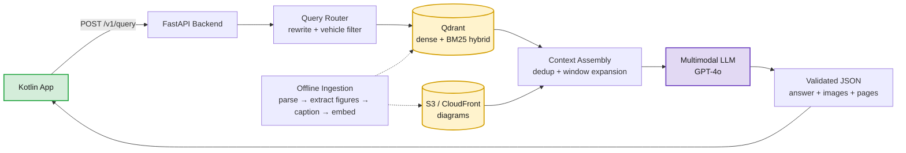

# Auto-M-RAG

**A multimodal RAG backend that answers car maintenance questions with the manual's own instructions — and the right diagram.**

Ask *"how do I change the oil in my 2019 Civic?"* and get back the actual procedure, cited to page 45, with the exploded view of the drain plug assembly attached. Ask *"which fuse is the rear wiper?"* and get the exact row from the fuse table plus the fuse-box layout figure.

Auto-M-RAG indexes dense 60–90 page automotive owner's manuals — two-column layouts, maintenance-interval tables, and vector-drawn mechanical diagrams — and serves a Kotlin Android client over a strict JSON API.

**Status: working, fully deployed prototype.** 5 manuals indexed end to end, serving a real client, with an evaluation harness, an operational runbook and a one-command rollback path. Every number below comes from that running system. What separates it from a production service is written down explicitly — [§16.3](ARCHITECTURE.md#163-path-to-production-in-priority-order).

> Full implementation write-up — component by component, with every engineering decision and every problem we hit: **[ARCHITECTURE.md](ARCHITECTURE.md)**.

---

## What it does

| | |
|---|---|
| **Input** | A plain-English question + the vehicle selected in the app's garage |
| **Corpus** | 5 complete vehicle manuals, ~450 pages, text **and** diagrams |
| **Output** | Grounded answer, page citations, up to 3 relevant diagrams, safety warnings — as validated JSON |
| **Client** | Kotlin / Android (text into a `TextView`, images into Coil) |
| **Deployment** | One container + Qdrant Cloud + S3/CloudFront. That's the whole system. |
| **Safety stance** | Abstains rather than guesses. A wrong torque spec is worse than no answer. |

### Example response

```json
{
  "status": "success",
  "answer": "To change the oil, first locate the 14 mm drain plug under the oil pan...",
  "images": [
    { "url": "https://cdn.auto-m-rag.io/honda/civic/2019/web/p045_f01.png?Expires=...",
      "page": 45, "caption": "Engine oil drain assembly" }
  ],
  "source_pages": [45, 46],
  "warnings": ["The engine and oil may be hot. Allow the engine to cool before draining."],
  "confidence": "high",
  "latency_ms": 4610
}
```

---

## Results

Evaluated against a hand-built golden set of **150 queries** — **135 answerable + 15 deliberately unanswerable**, the latter to test that the system abstains instead of inventing.

**Retrieval** (135 answerable queries, binary per query, 95% Wilson intervals)

| Metric | Result | 95% CI |
|---|---|---|
| Recall@3 | 76.3% (103/135) | [68.5%, 82.7%] |
| **Recall@5** | **85.2% (115/135)** | **[78.2%, 90.2%]** |
| Recall@10 | 91.9% (124/135) | [86.0%, 95.4%] |
| **MRR** | **0.69** | — |

**58% of queries put the correct chunk in position one**, and the rank distribution decays steeply from there — the generator usually sees the best evidence first.

**Generation** (LLM-as-a-judge, claim-level)

| Metric | Result | 95% CI |
|---|---|---|
| **Faithfulness** | **91.4% (523/572 claims)** | **[88.9%, 93.5%]** |
| — actively contradicted | 8 claims (1.4%) | — |
| **Answer Relevance** | **4.42 / 5 (88.4%)** | — |
| Abstention accuracy | 86.7% (13/15) | small n — indicative |

**Latency:** 4.6 s p50 · 5.2 s mean · 8.4 s p95. Generation is 78% of that; everything the backend controls totals ~290 ms.

**Scale:** ~1,400 text chunks + ~820 figure captions = ~2,220 vectors.

> **Read the intervals, not the decimals.** 135 queries puts a ±3 pp standard error on the retrieval figures. That is enough to detect a new parser and *not* enough to detect a reranker worth 3 points — which is exactly why [one was evaluated and deferred](ARCHITECTURE.md#adr-8-cross-encoder-reranking-evaluated-and-deferred).

### How it got there

| Build | Change | Recall@5 | Δ | vs. noise |
|---|---|---|---|---|
| v0 | Baseline: stream-order parse, fixed chunks, dense-only | 45.2% | — | — |
| v1 | Layout-aware parsing + semantic chunking | 62.2% | +17.0 | **5.5σ** |
| v2 | Figure extraction + image captions | 68.1% | +5.9 | 1.9σ |
| v3 | **Structured caption prompt with page context** | 75.6% | +7.5 | **2.4σ** |
| v4 | Hybrid BM25 fusion, α tuned to 0.7 / 0.3 | 82.2% | +6.6 | **2.1σ** |
| **v5** | Metadata filters, breadcrumbs, dedup, expansion | **85.2%** | +3.0 | 1.0σ |

Two things worth reading off this table:

**Every large gain came from data preparation, not model or algorithm choice.** Parsing and captioning account for 24.5 of the 40 points. Fusion tuning — the part that looks most like ML — contributed 6.6.

**The last step is inside the noise floor, and it shipped anyway.** The metadata filter provides a safety property the metric cannot see: it makes cross-vehicle retrieval structurally impossible. A Ford torque spec returned for a Toyota query counts as *one miss* in Recall@5 — the metric is indifferent, and the user's gearbox is not. Some changes are justified by a guarantee rather than an average.

---

## Architecture at a glance



**Offline:** manuals are parsed layout-aware, figures are extracted (including vector-drawn ones), captioned by a VLM into dense searchable text, chunked semantically, and embedded into Qdrant with `make` / `model` / `year` metadata.

**Online:** the query is rewritten and routed, hybrid-searched under a hard vehicle filter, expanded into full context, and answered by a multimodal LLM that reads the actual diagram pixels — then validated into a strict schema before it reaches the phone.

Full diagrams and flows: [ARCHITECTURE.md §1–3](ARCHITECTURE.md#1-data-ingestion-pipeline-offline-phase).

---

## The four decisions that made it work

**1. VLM captioning instead of CLIP.** CLIP is trained on "a dog on a beach" and compresses away exactly what makes a technical diagram useful — its labels and its topology. We had a VLM write a structured description of each figure (component, labelled parts, verbatim transcribed text, spatial layout) and embedded *that* into the same vector space as the prose. Text and figures then compete for the same top-k, so a query lands on whichever modality actually answers it.
→ [ADR-2](ARCHITECTURE.md#adr-2-vlm-captioning-look-twice-over-clip)

**2. Hybrid retrieval under a hard metadata filter.** Dense vectors handle *"my steering wheel is shaking"*. BM25 handles *"Fuse F42"*, which dense embeddings smear together with F41 and F43. And `make`/`model`/`year` is a `must` filter, never a boost — a Ford torque spec returned for a Toyota query is a vehicle-damage failure, not a ranking miss.
→ [ADR-3](ARCHITECTURE.md#adr-3-hybrid-dense--sparse-retrieval-in-qdrant)

**3. Opaque image IDs instead of URLs.** The model sees `IMG_1`, `IMG_2`, `IMG_3` and returns IDs; the backend maps them to signed URLs. This exists because the model, shown real URLs, started synthesising plausible ones that 404'd. Removing URLs from the prompt makes that failure structurally impossible instead of merely rare.
→ [ADR-6](ARCHITECTURE.md#adr-6-opaque-image-ids-instead-of-urls-in-the-prompt)

**4. No Redis.** The cache is a pure optimisation — a miss costs one S3 GET. A component whose worst failure is "slightly slower" does not justify a third stateful service with its own uptime, credentials and failure modes, especially against a request that spends 3.6 s in generation. A bounded in-process `TTLCache` does the job, and the deployed system stays at two managed services and one container. The trigger for revisiting it is written down.
→ [ADR-9](ARCHITECTURE.md#adr-9-in-process-cache-instead-of-redis)

---

## Problems worth reading about

The full catalogue of 16 is in [ARCHITECTURE.md §12](ARCHITECTURE.md#12-problems-faced--how-we-solved-them). The three most instructive:

- **[Most diagrams were invisible to image extraction](ARCHITECTURE.md#p-2-vector-diagrams-invisible-to-image-extraction).** Manual figures are *vector artwork*, not embedded bitmaps, so `get_images()` found ~210 of them. Clip-rendering clustered path regions at 200 DPI found ~820. Before this fix, the "multimodal" system was mostly text with a few photographs.
- **[Answers that started at step 4](ARCHITECTURE.md#p-8-procedures-split-mid-step).** Fixed-size chunking split a ten-step oil change in half. Steps 1–3 were *let the engine cool* and *secure the vehicle on jack stands*. Fixed with list-atomic splitting, 15% overlap, and parent-window expansion at query time.
- **[Captions that said "a diagram of a car part"](ARCHITECTURE.md#p-4-generic-useless-image-captions).** Dozens of near-identical captions match every query equally, which is the same as matching none. A rigid caption schema plus ±400 characters of surrounding page context took Recall@5 from 68.1% to 75.6% — the second-largest single gain in the project.

---

## Tech stack

| Layer | Choice |
|---|---|
| API | Python 3.11, FastAPI, Pydantic v2, async throughout |
| Parsing | LlamaParse (layout-aware) + PyMuPDF (figure extraction) |
| Vision | GPT-4o for structured figure captioning |
| Retrieval | Qdrant — named `dense` + `sparse` vectors, payload filters & indexes |
| Sparse | BM25 via FastEmbed, custom automotive tokenizer |
| Generation | GPT-4o multimodal, Structured Outputs + server-side validation |
| Storage | AWS S3 + CloudFront signed URLs (24 h TTL) |
| Cache | In-process `TTLCache` — no extra service |
| Client | Kotlin / Android, Coil |

---

## API

```http
POST /v1/query
Content-Type: application/json

{
  "query": "How do I change the oil?",
  "vehicle": { "make": "honda", "model": "civic", "year": 2019 },
  "max_images": 3
}
```

All outcomes return **HTTP 200** with a `status` discriminator — `success`, `insufficient_context`, `need_vehicle`, `out_of_scope`, or `degraded` — so the Android client's retry-and-toast path never fires on a legitimate answer.

| Endpoint | Purpose |
|---|---|
| `POST /v1/query` | The RAG endpoint |
| `GET /v1/vehicles` | Vehicles with indexed manuals (populates the garage picker) |
| `POST /v1/feedback` | Thumbs up/down by `request_id` — feeds the golden-set backlog |
| `GET /healthz` · `/readyz` | Liveness / readiness |

Full contract: [ARCHITECTURE.md §9](ARCHITECTURE.md#9-api-layer--contracts).

---

## Limitations

Stated plainly, because they matter for anyone building on this:

- **5 manuals, ~2,220 vectors.** Quality at this scale says little about 200,000. The HNSW parameters, dedup threshold and abstention threshold are all tuned to a corpus that fits in memory.
- **~1 in 7 queries misses the top 5.** The abstention policy turns most misses into an honest "not in your manual" rather than a wrong answer — but 4.4% of answerable queries get abstained on when they shouldn't be.
- **The evaluation set is too small to steer by.** ±3 pp cannot resolve the changes now worth making. Growing it is a prerequisite, not a nice-to-have.
- **Caption quality bounds image retrieval.** A figure whose labels are illegible in the source PDF is effectively unreachable.
- **No conversational memory.** "What about the rear one?" does not resolve.
- **English-only, owner's manuals only** — not service manuals, TSBs, or recall notices.

**Path to production**, in order: streamed answers (biggest perceived-latency win — 4.6 s down to ~900 ms to first token), grow the golden set to ~600 queries, then revisit the deferred reranker once both are done. Full roadmap: [ARCHITECTURE.md §16.3](ARCHITECTURE.md#163-path-to-production-in-priority-order).

---

## Documentation map

| Document | Contents |
|---|---|
| **[ARCHITECTURE.md](ARCHITECTURE.md)** | Data flows, HLD, full implementation (ingestion → retrieval → generation), Qdrant schema, config reference, 9 ADRs, 16 problems & fixes, evaluation harness, latency budget, runbook |
| [autorag_multimodal_project_documentation.md](autorag_multimodal_project_documentation.md) | Original project overview, build phases, and headline results |
