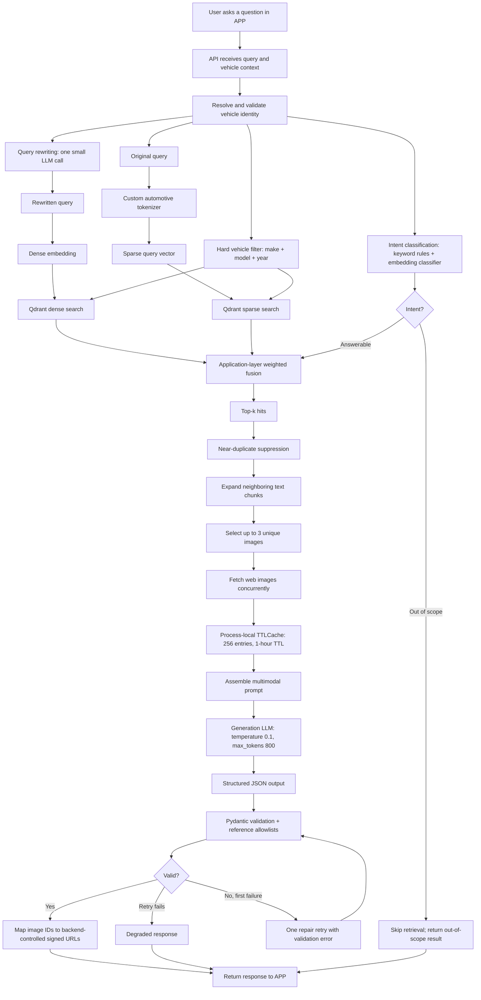
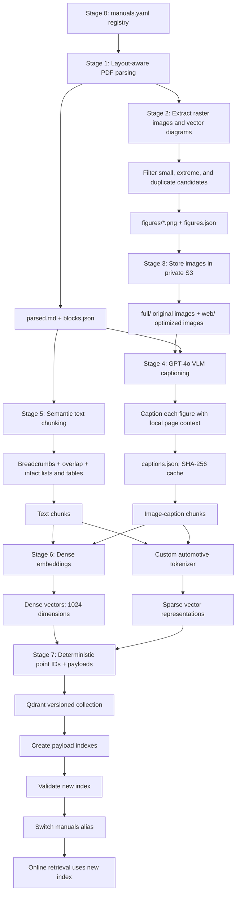

# Automotive Manual RAG: System Diagrams

This document shows the two main flows of the vehicle-manual RAG system:

1. **[Online Query Flow](#1-online-query-flow)**: how a user's question becomes a validated answer with images.
2. **[Offline Ingestion Pipeline](#2-offline-ingestion-pipeline)**: how PDF manuals are parsed, captioned, embedded and indexed in Qdrant.

---

## 1. Online Query Flow

When a user asks a question in the app, the API first resolves the vehicle. It then runs **hybrid retrieval**: a dense search on an LLM-rewritten query and a sparse search on the original query. Both searches are hard-filtered to the user's make, model and year. Questions classified as out of scope skip retrieval entirely. The fused results are de-duplicated and expanded with neighbouring chunks and images, then sent to the generation LLM. Its structured JSON output is validated, and repaired once if needed, before signed image URLs are attached and the response is returned.

| Phase | What happens |
| --- | --- |
| **Understand** | Vehicle validation, query rewriting, intent classification |
| **Retrieve** | Dense + sparse Qdrant search with a hard vehicle filter, weighted fusion |
| **Enrich** | Near-duplicate suppression, neighbour expansion, up to 3 cached images |
| **Generate** | Multimodal prompt → LLM (temp 0.1, 800 tokens) → structured JSON |
| **Validate** | Pydantic + reference allowlists, one repair retry, degraded fallback |

---

## 2. Offline Ingestion Pipeline

Each manual listed in the registry goes through an eight-stage batch pipeline. The PDF is parsed with its layout preserved, and figures are extracted, filtered and stored in private S3. A VLM captions each figure using its page context. Text is split into semantic chunks that keep lists and tables intact. Text chunks and caption chunks are then embedded as both dense and sparse vectors. The new index is built in a **versioned Qdrant collection**, and the `manuals` alias switches to it only after validation, so online retrieval never sees a half-built index.

| Stage | Step | Output |
| --- | --- | --- |
| 0 | Manual registry | `manuals.yaml` |
| 1 | Layout-aware PDF parsing | `parsed.md`, `blocks.json` |
| 2 | Image and diagram extraction | `figures/*.png`, `figures.json` |
| 3 | Image storage | Private S3: `full/` and `web/` |
| 4 | VLM captioning (GPT-4o) | `captions.json` (SHA-256 cached) |
| 5 | Semantic text chunking | Text chunks with breadcrumbs |
| 6 | Dense + sparse embedding | 1024-d dense vectors, sparse vectors |
| 7 | Indexing and alias switch | Validated Qdrant collection |

